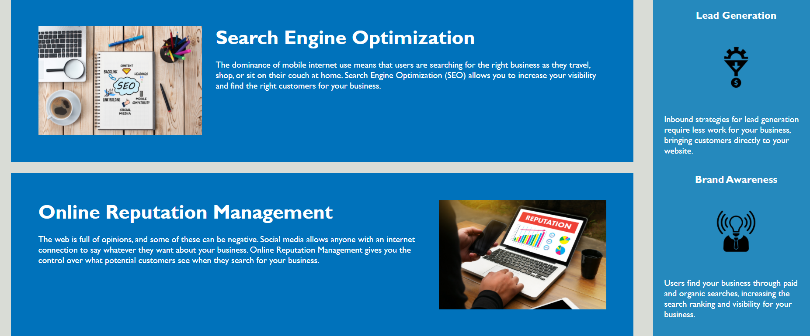
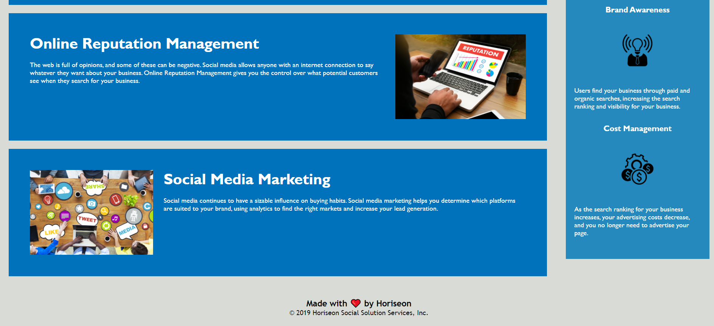

# Code Refactor Starter Code

# Description

Horiseon is a marketing agency looking to increase accessibility across it's webpage. The links throughout the page allow the consumer to connect to different sections of company benefits. In order to increase accessibility and increase Google search potential, descriptions of each image were added. 

# Image 
 
  

# Links
http://github/jgrossh2/Horiseon

# Technologies used
 *HTML  
 *CSS

 # Contributions
 Created by Joanna Grosshans, any questions please contact <joannagrosshans2@gmail.com>

 
